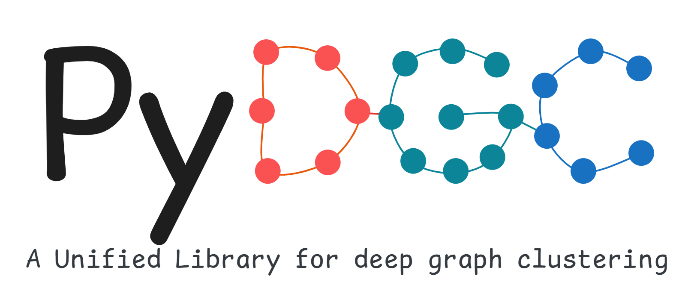

  <a href="#pydgc">Overview</a> |
  <a href="#pydgc">Installation</a> |
  <a href="#pydgc">Examples</a> |
  <a href="#pydgc">Docs</a> |
  <a href="#pydgc">Citation</a> 

# PyDGC

Coming soon! PyDGC is under development! 

The old repository (A unified framework for attribute graph clustering) can be found at https://github.com/Marigoldwu/PyDGC/releases/tag/v0.0.1

# Installation

# Citation