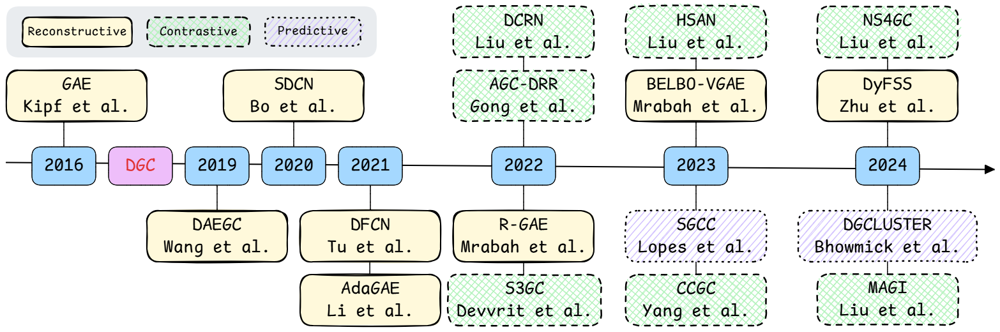
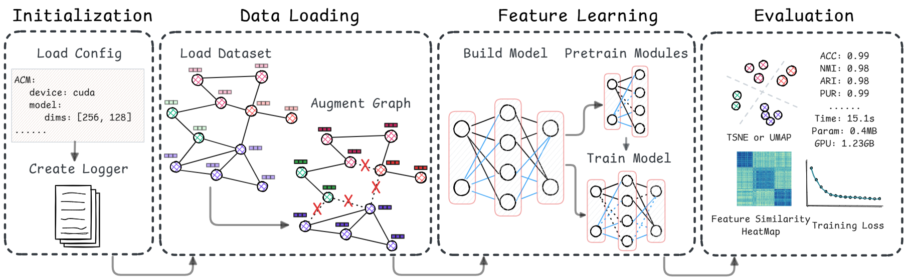

<div align="center">

</div>
<div align="center">
  <a href="#PyDGC">Overview</a> |
  <a href="#DGCBench">DGCBench</a> |
  <a href="#Installation">Installation</a> |
  <a href="#Examples">Examples</a> |
  <a href="#Docs">Docs</a> |
  <a href="#Citation">Citation</a> 
</div>

# PyDGC

**PyDGC**, a flexible and extensible Python library  for deep graph clustering (DGC), is compatible with frameworks such as PyG and OGB. It supports the easy integration of new models and datasets, facilitating the rapid development, reproduction, and fair comparison of DGC methods.

## News

- *2025.05*: Release source code of PyDGC.

## What is DGC?

Deep graph clustering, which aims to reveal the underlying graph structure and divide the nodes into different groups, has attracted intensive attention in recent years. 

More details can be found in the [survey](https://arxiv.org/abs/2211.12875) paper. Please click [here](./articles) to view the comprehensive archive of papers.

Timeline of representative models.

<div align="center">

</div>

## DGCBench

**DGCBench** encompasses 12 diverse datasets with different characteristics and 12 state-of-the-art methods from all major paradigms. By integrating them into a standardized pipeline, we ensure fair, reproducible, and comprehensive evaluations across multiple dimensions. 

 ## Features

- Integration of multiple deep graph clustering models. [Supported Models](#Supported-Models)
- Support for various graph datasets from PyG and OGB. [Supported Datasets](#Supported-Datasets)
- Model evaluation and visualization capabilities.
- Standardized Pipeline.

### Overview of Pipeline

<div align="center">

</div>

# Installation

- Install with Pip

  coming soon...

- Installation for local development

  ```bash
  git clone https://github.com/Marigoldwu/PyDGC.git
  cd PyDGC
  pip install -e .
  ```

# Examples

## Reproduce built-in models

Take GAE as an example:

```bash
cd PyDGC/example/pipelines/gae
python run.py
```

You can also specify arguments in the command line:

```bash
python run.py --dataset_name CORA -eval_each
```

Other optional arguments:

```bash
--cfg_file_path YourPath  # path of corresponding configurations file
--flag FlagContent  # Descriptions
--drop_edge float  # probability of dropping edges
--drop_feature float  # probability of dropping features
--add_edge float  # probability of adding edges
--add_noise float  # standard deviation of Gaussian Noise
-pretrain  # only run the pretraining stage in the model
```

## Develop your own DGC model

```python
from pydgc.models import DGCModel

class MyModel(DGCModel):
    def __init__(self, logger, cfg):
        super(MyModel).__init__(logger, cfg)
        your_model = ...  # Your model
        
        self.loss_curve = []
        self.nmi_curve = []
        self.best_embedding = None
        self.best_predicted_labels = None
        self.best_results = {'ACC': -1}
    
    def forward(self, data):
        ...  # forward process
        return something
    # If needed
    def loss(self, *args, **kwargs):
    # If needed
    def pretrain(self, data, cfg, flag):
    
    def train_model(self, data, cfg, flag):
    
    def get_embedding(self, data):
    
    def clustering(self, data):
        embedding = self.get_embedding(data)
        # clustering
        return embedding, labels_, clustering_centers
    
    def evaluate(self, data):
        embedding, predicted_labels, clustering_centers = self.clustering(data)
        ground_truth = data.y.numpy()
        metric = DGCMetric(ground_truth, predicted_labels.numpy(), embedding, data.edge_index)
        results = metric.evaluate_one_epoch(self.logger, self.cfg.evaluate)
        return embedding, predicted_labels, results

```

## Develop your own DGC pipeline

```python
from pydgc.pipelines import BasePipeline
from pydgc.utils import perturb_data
import MyModel  # import your own model

class MyPipeline(BasePipeline):
    def __init__(self, args):
        super(MyPipeline).__init__(args)
    
    def augmentation(self):
        self.data = perturb_data(self.data, self.cfg.dataset.augmentation)
        # other augmentations if needed
        
    def build_model(self):
        model = MyModel(self.logger, self.cfg)
        self.logger.model_info(model)
        return model
```

# Supported Models

| No.  | Model     | Paper | Source Code |
| ---- | --------- | ----- | ----------- |
| 1    | GAE       |       |             |
| 2    | GAE_SSC   |       |             |
| 3    | DAEGC     |       |             |
| 4    | SDCN      |       |             |
| 5    | DFCN      |       |             |
| 6    | DCRN      |       |             |
| 7    | AGC-DRR   |       |             |
| 8    | DGCluster |       |             |
| 9    | HSAN      |       |             |
| 10   | CCGC      |       |             |
| 11   | MAGI      |       |             |
| 12   | NS4GC     |       |             |

# Supported Datasets

| No.  | Dataset      | #Samples | #Features | #Edges | #Classes | Homo. Ratio |
| ---- | ------------ | -------- | --------- | ------ | -------- | ----------- |
| 1    | Wiki         |          |           |        |          |             |
| 2    | Cora         |          |           |        |          |             |
| 3    | ACM          |          |           |        |          |             |
| 4    | Citeseer     |          |           |        |          |             |
| 5    | DBLP         |          |           |        |          |             |
| 6    | PubMed       |          |           |        |          |             |
| 7    | Ogbn-arXiv   |          |           |        |          |             |
| 8    | USPS         |          |           |        |          |             |
| 9    | HHAR         |          |           |        |          |             |
| 10   | BlogCatalog  |          |           |        |          |             |
| 11   | Flickr       |          |           |        |          |             |
| 12   | Roman-empire |          |           |        |          |             |

# Citation


# Related Repositories

ADGC: [Awesome-Deep-Graph-Clustering](https://github.com/yueliu1999/Awesome-Deep-Graph-Clustering)

Older version of this repository: [A-Unified-Framework-for-Attribute-Graph-Clustering](https://github.com/Marigoldwu/PyDGC/releases/tag/v0.0.1)